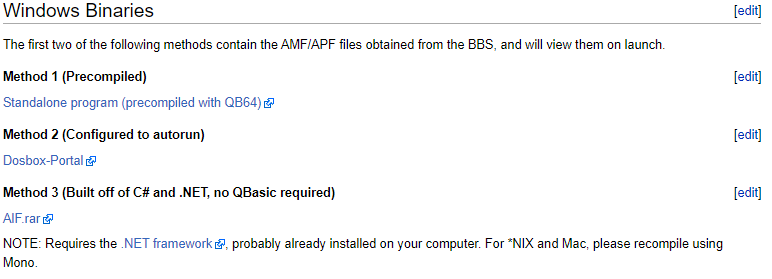
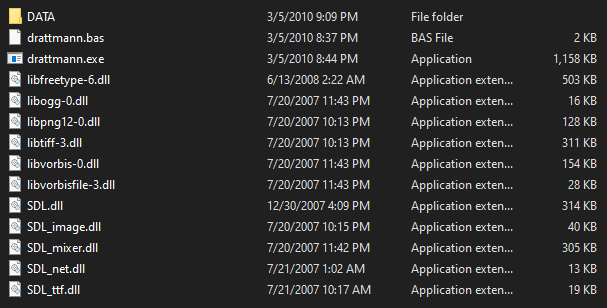
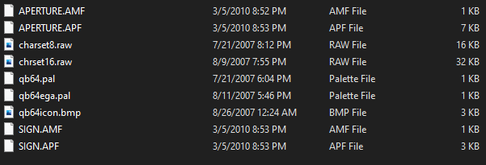
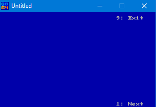
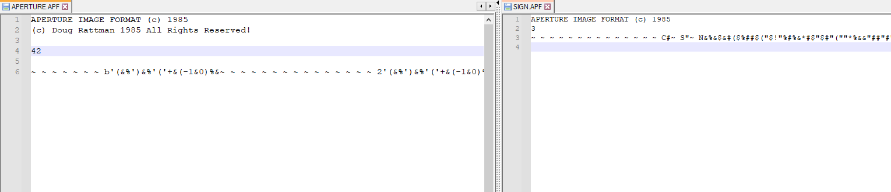
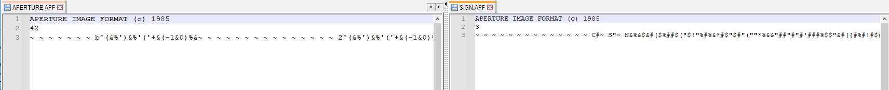
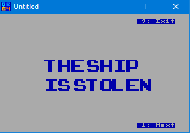

# Writeup

We are given an unusual file, the challenge description and name clearly relate to the popular game series Portal.

By running cat on the file, we can see that the first two lines read, which means that this is potentially our file header. A pretty unusual file indeed. 
```text
APERTURE IMAGE FORMAT (c) 1985
(c) Doug Rattman 1985 All Rights Reserved!
```

A quick Google search of the header points us to this [link](http://portalwiki.asshatter.org/index.php/Aperture_Image_Format.html).  

From that link, we are given a bunch of info about the structure of the file that is given to us. Something which stands out immediately is the GW-Basic code for viewing these types of files. It is safe assume that we have to view the image using this code, but how?

Thankfully there are some precompiled binaries available us for us to download which allows us to view the image. Otherwise, we would have to configure something called QB64 in order to run the code. 



Method 1 is the simplest way to approach things, a standalone program precompiled with QB64. We download that.



We see a few files here, we run drattman.exe and we can see that it is displaying an image with a menu. We can see them referenced in the wiki.

```
AMF = "Aperture Menu Format", contains position and text data for menus to display over an image

APF = "Aperture Picture Format", contains image data

All AMF and APF files must be stored in a directory named "DATA"
```

We can see in the image viewer directory that we have a folder called DATA, we can open that and see a few files.



We know our header stated that it was an Aperture Picture Format file which means that we have identified our file type which is APF. Maybe we can simply just rename our file to APERTURE.APF and replace the current file the viewer is viewing and that should view the image! It can't be this easy, can it?



Looks like it can't be this easy, an image is not being displayed. This could mean that the image that we are given is corrupted, after all this is a forensics challenge. The first thing that we need is a known working image. In the DATA directory, we can see that there is a file called SIGN.APF, and it displays a sign when our viewer is ran meaning that this file is in good shape and is a good example to manually repair our file.




Opening up both the challenge file and the SIGN.APF file side to side in Notepad++, we can see a variety of differences. The main one which stands out is that the line ```(c) Doug Rattman 1985 All Rights Reserved!``` is not in the "known good" image header, which means that it is probably safe to remove it. We also see a few new lines, just to be safe, we should remove the new lines too.



The edited file should look like this, both look pretty similar, let's give the viewer another try.



And there we have it, our hidden message! Looks like GlaDOS was trying to warn us that our ship was stolen. Thanks GlaDOS!

Flag : `vsctf{THESHIPISSTOLEN}`

