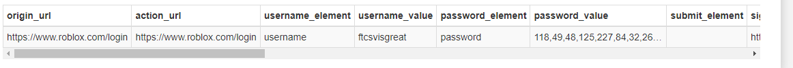

# Writeup

We are given an AD1 file and we can open it in FTK Imager through File > Add Evidence Item > Image File > Select.

We end up with 3 folders, Users, Perflogs, and Program Files. We need to retrieve the users main Roblox account, so the first thing that comes to mind is looking through Chrome saved data. 

With a bit of research we figure out that location of the Chrome saved passwords are in a sqlite file located at `C:\Users\adminbot6000\AppData\Local\Google\Chrome\User Data\Default\Login Data`. We open the sqlite file to see if there is anything there, and indeed the username is there under `username_value`!

Flag : vsctf{ftcsvisgreat}
