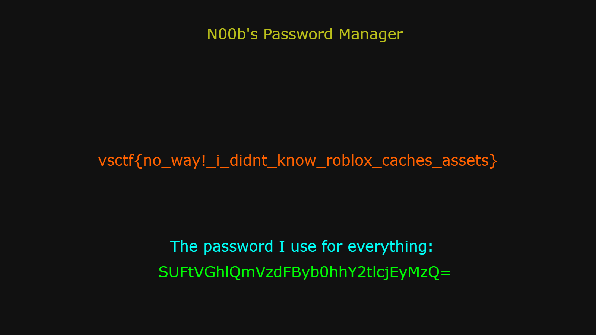

# RoRansom 2

## **Motivation**
Growing up, Roblox played a significant role in my life. I have memories of exploiting the game back in 2016. Drawing from this nostalgia, I aimed to craft a challenge combining forensics, log analysis, and OSINT. Moreover, I wanted to elevate the difficulty in comparison to the previous year's vsCTF Roblox challenges.

## **Solution Steps**

### **1. Pinpointing the Cached Asset**
The challenge description nudges us towards locating a cached asset file on our system. While Roblox caches assets in several locations, the one of interest for this challenge is:
`\Users\ftcsvisgreat\AppData\Local\Roblox\Downloads\roblox-player``

### **2. Identifying the Archive Files**
Within this directory, you'll come across PK archive files. Their header is a telltale sign of their nature.

### **3. Unearthing the Suspicious File**
Exploring the `21fd7fb4cb43649c282e79ec9b4e1de7\` archive reveals a file that raises eyebrows - `pswdmgr.png`. This is the treasure we've been hunting for.

Flag: `vsctf{no_way!_i_didnt_know_roblox_caches_assets}`