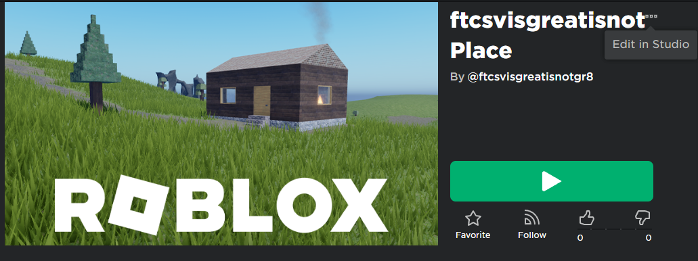
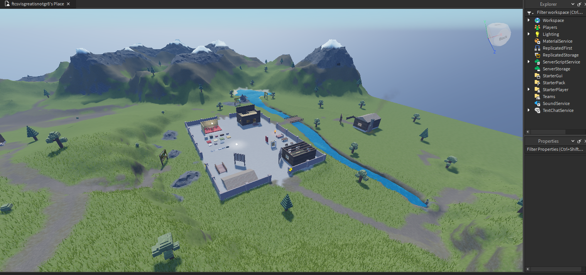
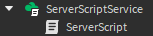
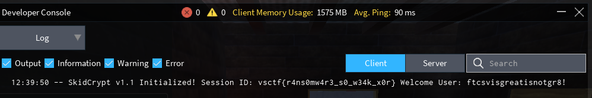

# RoRansom 3

## Motivation
Growing up, Roblox played a significant role in my life. I have memories of exploiting the game back in 2016. Drawing from this nostalgia, I aimed to craft a challenge combining forensics, log analysis, and OSINT. Moreover, I wanted to elevate the difficulty in comparison to the previous year's vsCTF Roblox challenges.

## Solution
## **Solution Steps**

### **1. Diving into the Hacker's Main Account**
With insights from RoRansom 1, we're aware of the hacker's primary account - `ftcsvisgreatisnotgr8`. Heading to their profile and delving into their creations - [Profile Creations](https://www.roblox.com/users/5055058044/profile/#!/creations), reveals a game crafted by the hacker. Upon joining, it seems barren, but a hint from the previous year's vsCTF Roblox challenges prompts us to look deeper.

### **2. Uncopylocked Game: A Potential Goldmine?**
Hints suggest a possibility that the game could be uncopylocked, allowing us to peek into its code. And indeed, it is editable in the studio!

On launching it in the studio, we're greeted with the following setup:


### **3. Investigating the ServerScriptService**
A closer examination of the `ServerScriptService` reveals a script named `ServerScript`.


```lua
local A, B, C, D, E, F = "1a2a04302b173b15075426434179412a050c0658", "535f5d3324097548362716001d3f1c4f0125594b", "13015246554f3b7503275808355101470f015f17", "16505f0e2d49024149691608380b0a2f00532123", "171d7241051f0601475b40533b240c2001162c0a", "0713224a4e"
local G = A..B..C..D..E..F
local H = function(I) local J = ""; for K = 1, #I, 2 do J = J .. string.char(tonumber(string.sub(I, K, K+1), 16)) end; return J end
local L = {data=H(G)}
local M = function(N, O) local P = ""; for Q = 1, #N do local R = string.sub(N, Q, Q); local S = string.sub(O, (Q - 1) % #O + 1, (Q - 1) % #O + 1); P = P .. string.char(bit32.bxor(string.byte(R), string.byte(S))) end; return P end
local T = function() local U = ""; local V = M(L.data, U); print(V) end
T()
```

The script seems to be performing an XOR operation, but the XOR key remains elusive.

### **4. A Flashback to RoRansom 2**
Recalling the extra Base64 text from RoRansom 2 - `SUFtVGhlQmVzdFByb0hhY2tlcjEyMzQ=`, and decoding it yields `IAmTheBestProHacker1234`. Could this be the missing XOR key? Let's plug it in to the variable `U`.

Modifying the script to include the XOR key, we get:

```lua
local A, B, C, D, E, F = "1a2a04302b173b15075426434179412a050c0658", "535f5d3324097548362716001d3f1c4f0125594b", "13015246554f3b7503275808355101470f015f17", "16505f0e2d49024149691608380b0a2f00532123", "171d7241051f0601475b40533b240c2001162c0a", "0713224a4e"
local G = A..B..C..D..E..F
local H = function(I) local J = ""; for K = 1, #I, 2 do J = J .. string.char(tonumber(string.sub(I, K, K+1), 16)) end; return J end
local L = {data=H(G)}
local M = function(N, O) local P = ""; for Q = 1, #N do local R = string.sub(N, Q, Q); local S = string.sub(O, (Q - 1) % #O + 1, (Q - 1) % #O + 1); P = P .. string.char(bit32.bxor(string.byte(R), string.byte(S))) end; return P end
local T = function() local U = "IAmTheBestProHacker1234"; local V = M(L.data, U); print(V) end
T()
```

Surely enough, when we open the console again, our decrypted text shows up along with the flag.


Flag: `vsctf{r4ns0mw4r3_s0_w34k_x0r}`

